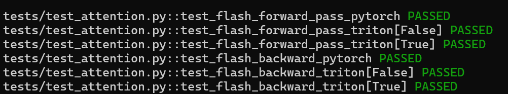
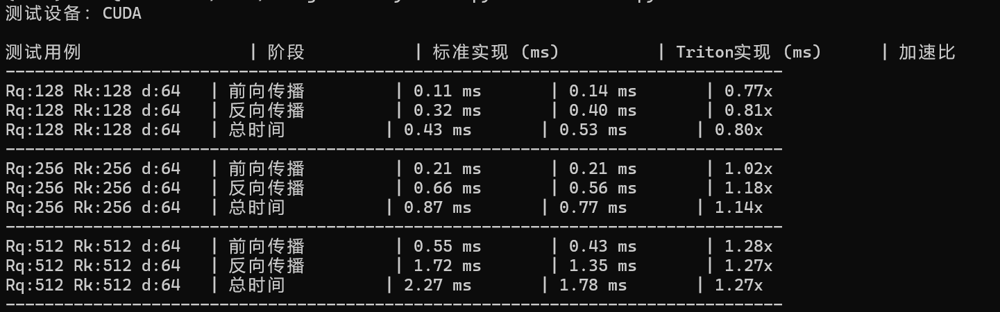
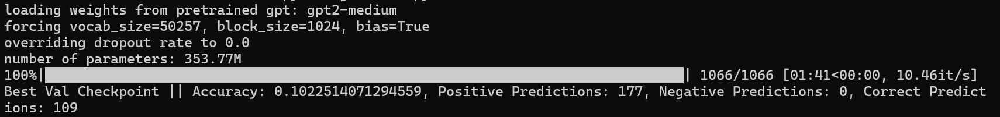
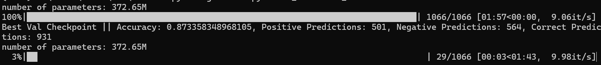

# About-LLM-
Some implementation about LLM.
## Systems
A triton implementation of FlashAttention-2. Passed all tests in test_attention.py in cs336 assignment2.

### Benchmark
Use a script to compare the torch implementation and triton implementation, reached a high acceleration rate in large dataset.

### Acknowledgements
-https://github.com/stanford-cs336/assignment2-systems - [Referenced the test cases]

## LoRA
Use LoRA in attention layers to fine tune the GPT2-medium on Rotten Tomatoes dataset. Imoproved the correctness from 10% to 87%

